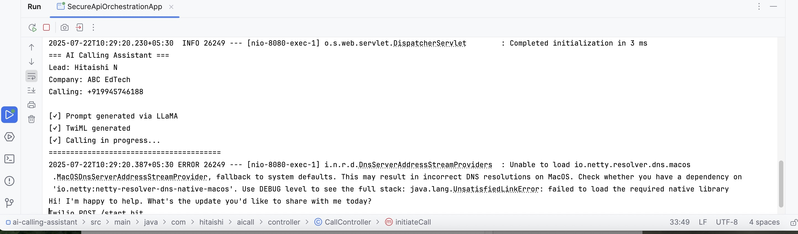
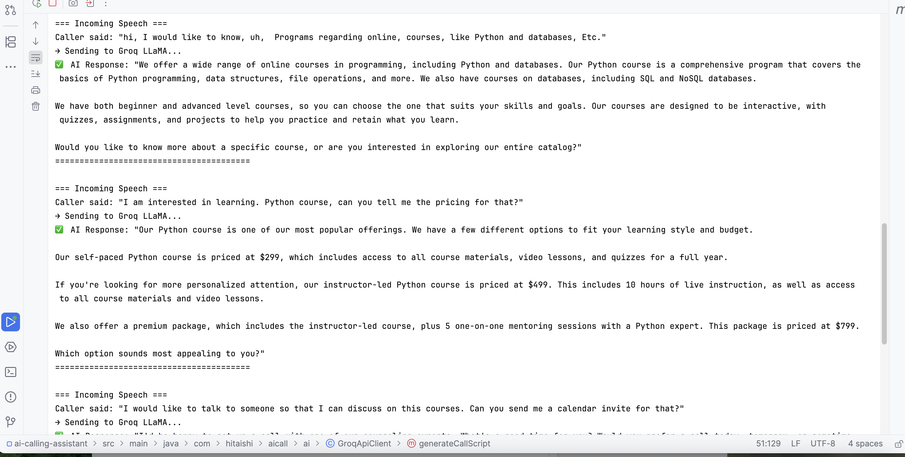

# AI Calling Assistant (Java)

> A fully automated AI-powered calling assistant that engages leads, responds like a real salesperson, and books meetings — with zero human intervention (unless absolutely necessary).

---

## Overview

**AI Calling Assistant** is a smart voice automation tool built for outbound sales. It combines:

- Contextual lead intelligence  
- Human-like TTS voice (via Twilio)  
- Dynamic AI logic (via Groq-hosted LLaMA)

It doesn't just score leads — it **calls them**, handles objections, and schedules appointments. Think: your best SDR, available 24/7.

---

## Product Thinking Behind the Build

As a **Product Manager**, I’ve seen where outbound sales efforts break:

- Scripts fail under pressure.
- SDRs burn time on low-quality leads.
- AI tools stop at dashboards — not results.

This tool was built to **replace manual outreach** with a fully autonomous voice experience that still feels personal and strategic.

| Skill                        | Demonstrated Through                                               |
|-----------------------------|----------------------------------------------------------------------|
| Voice + AI Workflow Design  | Twilio TTS + LLaMA integration for dynamic, real-time conversations |
| AI Product Fluency          | Prompt design + output parsing from Groq-hosted models              |
| System Thinking             | End-to-end: lead → AI strategy → voice call → booking               |
| Human-in-the-Loop Awareness | Routes unclear cases to real reps when needed                       |
| Compliance Mindset          | GDPR/AU Privacy Act-aware architecture                              |
| Cross-Functional Execution  | Built backend, AI logic, Twilio stack, and calendar sync            |

---

## Features

- AI-generated call scripts using Groq + LLaMA
- Real-time outbound calling with lifelike voice (Twilio TTS)
- Handles objections + fallback scenarios
- Escalates to a human rep if needed
- Auto-books calendar invites
- GDPR + AU Privacy Act conscious
- Modular, API-first backend (Java + Spring Boot)

---

## Tech Stack

| Layer         | Tech                         |
|---------------|------------------------------|
| Backend       | Java + Spring Boot           |
| Voice Engine  | Twilio (TwiML, TTS)          |
| AI Layer      | Groq-hosted LLaMA            |
| Prompt Logic  | Custom scripting             |
| Calendar Sync | ICS-based invite generator   |
| Frontend      | *(Optional)* React dashboard |

---
## Getting Started

```bash
# Clone the repository
git clone https://github.com/hitaishin-17/ai-calling-assistant.git
cd ai-calling-assistant-java/backend

# Open in IntelliJ or your favorite IDE
# Make sure to add your Twilio + Groq keys in application.properties or .env

TWILIO_ACCOUNT_SID=your_sid
TWILIO_AUTH_TOKEN=your_token
TWILIO_PHONE_NUMBER=your_twilio_number

GROQ_API_KEY=your_groq_key

```

## Sample Flow
	1.	Lead data is passed via API
	2.	AI generates a custom call script
	3.	Twilio places a real-time voice call
	4.	LLM responds dynamically based on user replies
	5.	Appointment is booked and invite is sent
	6.	If AI is unsure or detects complexity → routes to a human rep

 ---

## 📽️ Demo & Screenshots

### Voice Call in Action (Terminal Trigger)


### Sample AI Response (Console Output)


> 👉 Watch the demo video: [Click to View](https://www.loom.com/share/your-demo-link)

---

## Future Enhancements

1. Streaming voice recognition (STT → AI → TTS loop)
2. Lead enrichment from CRM before calling
3. Multi-language support
4. React dashboard for live call tracking
5. Zapier / Slack integration
6. GDPR/AU-compliant logging & audit trail

## 📩 About the Creator

Hi, I’m Hitaishi N — I build intelligent, voice-first systems that turn ambiguity into action.

This project started with a simple frustration: sales teams were spending hours chasing leads, yet most conversations felt robotic or went nowhere. I wanted to build something that could handle the entire flow — from context to conversation to calendar — without the need for constant human input.

So I prototyped fast, kept things modular, and shipped something that actually calls people, handles objections, and gets results — all while respecting data privacy across the UK, EU, and Australia.


Let’s connect on [LinkedIn](https://www.linkedin.com/in/hitaishi-n-grovista)!
