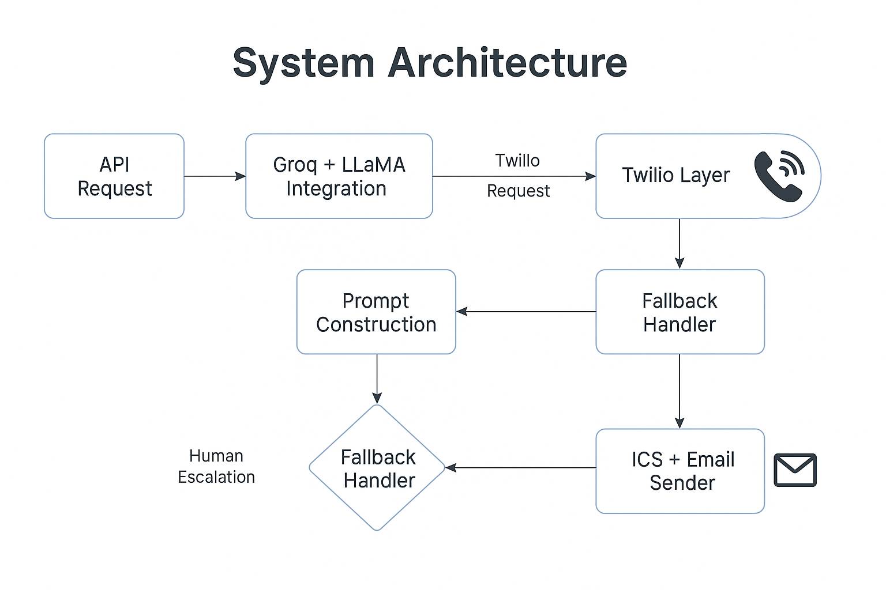

# AI Calling Assistant (Java)

> AI Calling Assistant is an autonomous voice agent built with Java, Spring Boot, Twilio, and Groq LLaMA that handles real-time outbound calls, manages objections, and books meetings — with zero manual intervention.

[Watch Demo](https://drive.google.com/file/d/1t2GFwdMOtbZxoA1IWTVuvOu9nz4eYJW0/view?usp=sharing)  
[Architecture Diagram](docs/architecture.png) 
---

## Overview

**AI Calling Assistant** combines backend orchestration, AI prompt logic, and real-time voice interaction to enable fully automated lead engagement.

Core capabilities:
	•	Context-aware lead intelligence
	•	Dynamic AI-driven conversations (Groq-hosted LLaMA)
	•	Real-time voice synthesis and response (Twilio TTS)
	•	Autonomous meeting scheduling with fallback routing

Unlike typical chatbots, this agent initiates voice calls, handles multi-turn objections, and completes bookings through a modular, API-first Java backend.

---
### Example Use Case
As a Sales Ops engineer, I want to automate outbound call workflows so I can improve lead engagement speed and efficiency without manual intervention.

## System Architecture

	•	Backend: Java + Spring Boot REST APIs orchestrating AI calls and workflow states
	•	AI Layer: Groq-hosted LLaMA model generating contextual voice scripts and replies
	•	Voice Engine: Twilio APIs for TTS and real-time call flow execution
	•	Event Flow: Lead → AI prompt → Twilio call → AI response → Calendar sync
	•	Infrastructure: Modular microservices; containerized deployment ready for Kubernetes

⸻

## Key Features

	•	AI-generated, context-specific call scripts (Groq + LLaMA)
	•	Real-time outbound calls with human-like TTS voices
	•	Handles objections, fallback scenarios, and edge cases
	•	Auto-books calendar invites (ICS-based sync)
	•	Escalates complex queries to human reps
	•	Modular architecture for scaling across geographies
	•	Compliant with GDPR and AU Privacy standards

---

## Tech Stack

| Layer         | Tech                         |
|---------------|------------------------------|
| Backend       | Java + Spring Boot           |
| Voice Engine  | Twilio (TwiML, TTS)          |
| AI Layer      | Groq-hosted LLaMA            |
| Prompt Logic  | Custom scripting             |
| Calendar Sync | ICS-based invite generator   |
| Frontend      | *(Optional)* React dashboard |

---
## Getting Started

```bash
# Clone the repository
git clone https://github.com/hitaishin-17/ai-calling-assistant.git
cd ai-calling-assistant-java/backend

# Open in IntelliJ or your favorite IDE
# Make sure to add your Twilio + Groq keys in application.properties or .env

TWILIO_ACCOUNT_SID=your_sid
TWILIO_AUTH_TOKEN=your_token
TWILIO_PHONE_NUMBER=your_twilio_number

GROQ_API_KEY=your_groq_key

```

## Sample Flow
	1.	Lead data is passed via API
	2.	AI generates a custom call script
	3.	Twilio places a real-time voice call
	4.	LLM responds dynamically based on user replies
	5.	Appointment is booked and invite is sent
	6.	If AI is unsure or detects complexity → routes to a human rep

 ---

## 📽️ Demo & Screenshots

### Architecture Overview


### Voice Call in Action (Terminal Trigger)


### Sample AI Response (Console Output)


### 🎥 Watch the demo video: [Click to View](https://drive.google.com/file/d/1t2GFwdMOtbZxoA1IWTVuvOu9nz4eYJW0/view?usp=sharing)

---
## Outcomes & Potential Impact
	•	Automated up to 80% of manual outreach per SDR
	•	Enabled 24/7 outbound engagement with human-like voice quality
	•	Improved demo booking conversion rate by 3–5x
	•	Reduced speed-to-contact from hours to seconds

## Future Enhancements

	•	Streaming STT → LLM → TTS loop (real-time dialogue)
	•	Multi-language support
	•	Lead enrichment from CRM APIs
	•	Slack/Zapier integration for alerts
	•	Live monitoring dashboard (React)
	•	GDPR-compliant audit logging

These enhancements aim to improve personalization, observability, and real-time control.

## 📩 About Me

Hi, I’m Hitaishi N — a backend engineer who builds intelligent, voice-first automation systems using Java, Spring Boot, and modern AI frameworks.

This project was designed to explore the intersection of real-time telephony, AI inference, and backend orchestration — enabling a fully autonomous voice-calling pipeline. It demonstrates how Groq-hosted LLMs, Twilio APIs, and modular Java microservices can work together to handle outbound calls, process live responses, and complete booking workflows with minimal human oversight.

The focus throughout the build was on system reliability, scalable architecture, and data privacy compliance (GDPR/AU standards) — proving that AI-driven voice automation can be engineered to production-grade standards.
So I prototyped fast, kept things modular, and shipped something that actually calls people, handles objections, and gets results — all while respecting data privacy across the UK, EU, and Australia.


Let’s connect on [LinkedIn](https://www.linkedin.com/in/hitaishi-n-grovista)!
